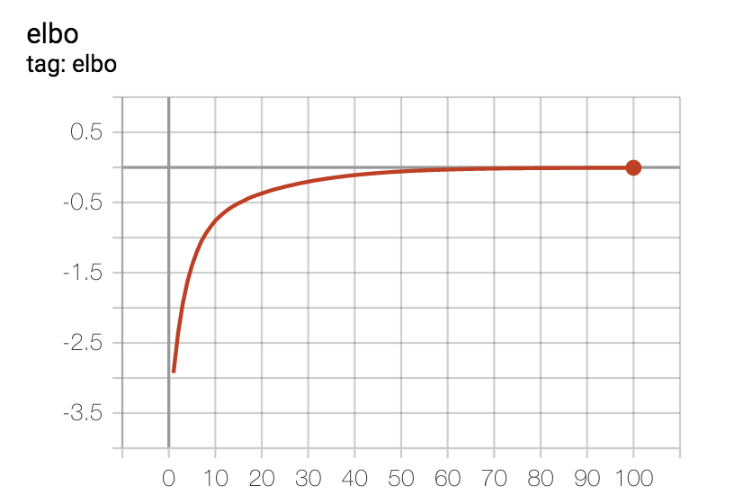
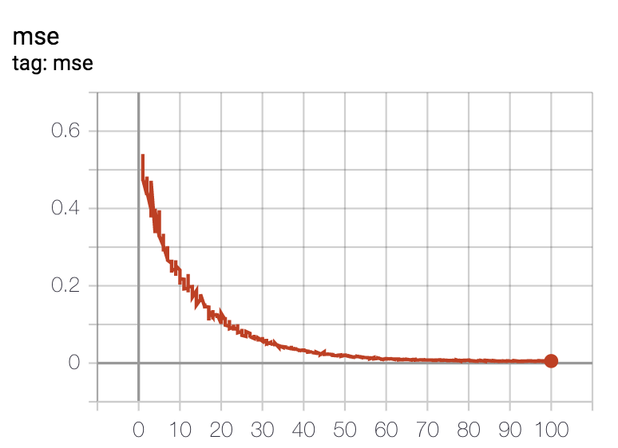

Variational Auto-Encoder for Gene Expression data using Tensorflow 2

Based on:
1. https://www.tensorflow.org/tutorials/generative/cvae
2. https://github.com/greenelab/tybalt
2. https://arxiv.org/pdf/1908.06278.pdf

Progress of the project:
- [x] Baseline model creation
- [x] Functions for evaluating mean, absolute difference and grouping in the latent space
- [ ] Model tuning 
   * latent space size
   * batch size, learning rate (epochs number should be determined with early stopping)
   * number of additional dense layers, number of neurons in each additional layer
- [ ] Conditional VAE model (multiple conditions?)
- [ ] b-VAE model (MSE / KL-divergence weight in the loss function)
- [ ] Correlated VAE (https://arxiv.org/pdf/1905.05335.pdf)

- `model.py ` - Layers and properties of the neural network
- `gtex_loder.py` - Loading gene expression dataset
- `vae_training.py` - Model Training and Testing

`python3 vae_training.py` to start the generation algorithm

`tensorboard --logdir logs/run{number_of_run}` to start tensorboard

Snapshots of TensorBoard scalars:

`ELBO` from epoch 1 to n_epochs

`KL Divergence (latent loss)` from epoch 1 to n_epochs

`MSE (reconstruction loss)` from epoch 1 to n_epochs

